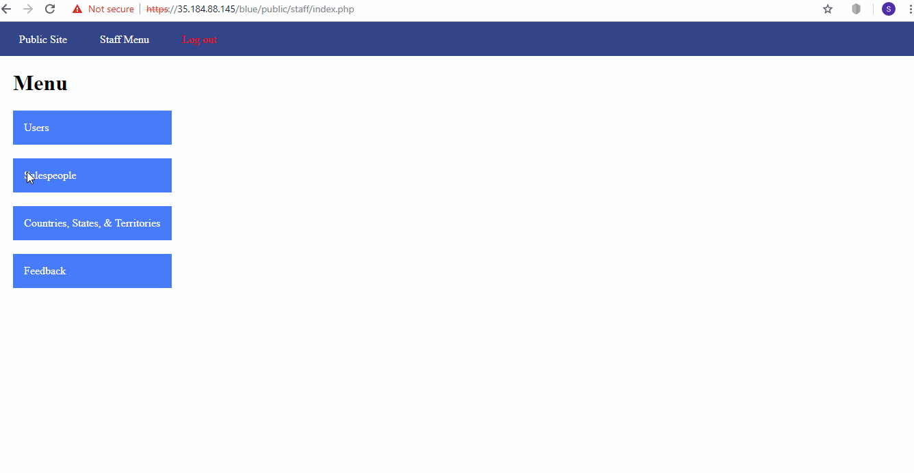

# Project 8 - Pentesting Live Targets

Time spent: **X** hours spent in total

> Objective: Identify vulnerabilities in three different versions of the Globitek website: blue, green, and red.

The six possible exploits are:
* Username Enumeration
* Insecure Direct Object Reference (IDOR)
* SQL Injection (SQLi)
* Cross-Site Scripting (XSS)
* Cross-Site Request Forgery (CSRF)
* Session Hijacking/Fixation

Each version of the site has been given two of the six vulnerabilities. (In other words, all six of the exploits should be assignable to one of the sites.)

## Blue

Vulnerability #1: Section Hijacking/Fixation

    Steps to recreate:
        * Login using given credentials in one browser.
        * Use "public/hacktools/change_session_id.php" in this browser to see the session id.
        * Copy the session id.
        * Go to a different browser and go to the page without login in.
        * Use "public/hacktools/change_session_id.php" to change the session id to the one in the previous browser.
        * Go back to the main page and you should be logged in.

Vulnerability #2: 

## Green

Vulnerability #1: __________________

Vulnerability #2: __________________

## Red

Vulnerability #1: __________________

Vulnerability #2: __________________

## Notes

Describe any challenges encountered while doing the work

## License

    Copyright [2018] [Sebastian Henriquez]

    Licensed under the Apache License, Version 2.0 (the "License");
    you may not use this file except in compliance with the License.
    You may obtain a copy of the License at

        http://www.apache.org/licenses/LICENSE-2.0

    Unless required by applicable law or agreed to in writing, software
    distributed under the License is distributed on an "AS IS" BASIS,
    WITHOUT WARRANTIES OR CONDITIONS OF ANY KIND, either express or implied.
    See the License for the specific language governing permissions and
    limitations under the License.
