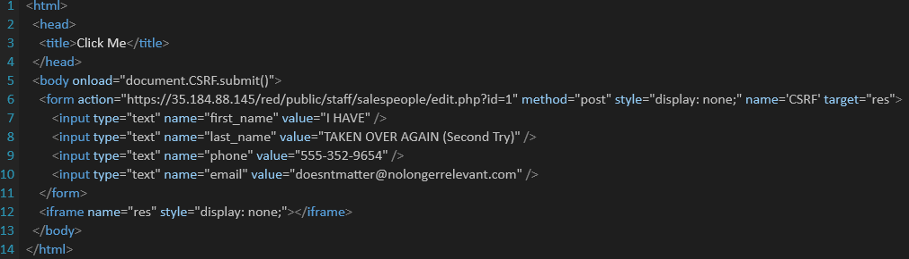

# Project 8 - Pentesting Live Targets

Time spent: 5 hours spent in total

> Objective: Identify vulnerabilities in three different versions of the Globitek website: blue, green, and red.

The six possible exploits are:
* Username Enumeration
* Insecure Direct Object Reference (IDOR)
* SQL Injection (SQLi)
* Cross-Site Scripting (XSS)
* Cross-Site Request Forgery (CSRF)
* Session Hijacking/Fixation

Each version of the site has been given two of the six vulnerabilities. (In other words, all six of the exploits should be assignable to one of the sites.)

## Blue

Vulnerability #1: Section Hijacking/Fixation

Steps to recreate:
* Login using given credentials in one browser.
* Use "public/hacktools/change_session_id.php" in this browser to see the session id.
* Copy the session id.
* Go to a different browser and go to the page without login in.
* Use "public/hacktools/change_session_id.php" to change the session id to the one in the previous browser.
* Go back to the main page and you should be logged in.

Vulnerability #2: SQL Injection (SQLi)

Steps to recreate:
* Login using given credentials.
* Go to sales people highlight on any of the users and click show.
* Once you are in next to id in the URL write 'OR 1=1 --' 
* This will automatically take you to the person at the top of the list (The person with id=1) which is enough to show the
  SQLi Vulnerability.

## Green

Vulnerability #1: Username Enumeration

Steps to recreate:
* Login using given credentials.
* Once you are logged in check the list of users and take note of the usernames.
* Logout and try to login with one of the usernames.
* Now try a random username not on the list and see if there is a difference.
* The difference here is that when you type the correct username with no password you get a bolded error message but
when the username is not on the list you get the error message without the bolded text.

Vulnerability #2:  Cross-Site Scripting (XSS)

Steps to recreate:
* Go to Public Site.
* Go to Contact us.
* Write a name and email and on feedback write and XSS alert message like ''.
* Summit response and go to login page.
* Login using given credentials.
* Once you are logged in go to feedback tab.
* There you should see the XSS message.

## Red

Vulnerability #1: Insecure Direct Object Reference (IDOR)

Steps to recreate:
* Login using given credentials.
* Once you are logged in check the list of sales people and take note of the names that are suppose to be private.
* Logout and go to the public site.
* Click on Find a Sales person and click on any of them.
* On the URL change the id to search for users you are not suppose to see. When changing the id to 10 or 11 you will find the users
that should not be public.

Vulnerability #2: Cross-Site Request Forgery (CSRF)

Steps to recreate:
* Create a form changing information on one of the salespeople.
* Log in using Credentials.
* Load Form on same browser while logged in.
* Changes should take place after reloading the salespeople page.
* Below is an image of the form used in the gif demo.

## Notes
Concept Review Questions:
* For me, The easier attack to implement where user enumerated and IDOR. User enumerated in particular was easier since we are already 
given the pperson login which makes testing easier since we already know one username. SQLI and XSS were more challenging for me mainly due to the fact that finding the place where the vulnerabilities could occur can be time consuming.
* After verifing every entrance to the site is secure, one Very important step to take to prevent Username Enumeration is to never give potential attackers any hints that they correctly guessed something. The error message for getting the user name and wrong password should be the same as the message for getting nothing wrong.
* Using AND  instead of OR can only work if you know want the first condition to be true. OR is used more than and for SQLI since usually you want the first condition to be ignored (False) and the SQLI condition to be executed. So with that in mind, AND cannot be a substitute for OR since they do different things.
* XSS attackers might include something ind the link that would entice the user to click on it faster or try to force the xss attack in a place the user visit often. 
* One Way to message the XSS form to the admin would be to send the admin a link to the form through a message through the site. If the classmate clicks on the link, the changes will be made.
* Comparing Session Hijacking/Fixation, In the assignment I choose hijacking since we had access to an username. However in most cases hijacking is more difficult since you need to know the username login to execute it. For Fixation, its just a matter of tricking the user into using your session id.  

## License
    Copyright [2018] [Sebastian Henriquez]

    Licensed under the Apache License, Version 2.0 (the "License");
    you may not use this file except in compliance with the License.
    You may obtain a copy of the License at

        http://www.apache.org/licenses/LICENSE-2.0

    Unless required by applicable law or agreed to in writing, software
    distributed under the License is distributed on an "AS IS" BASIS,
    WITHOUT WARRANTIES OR CONDITIONS OF ANY KIND, either express or implied.
    See the License for the specific language governing permissions and
    limitations under the License.
